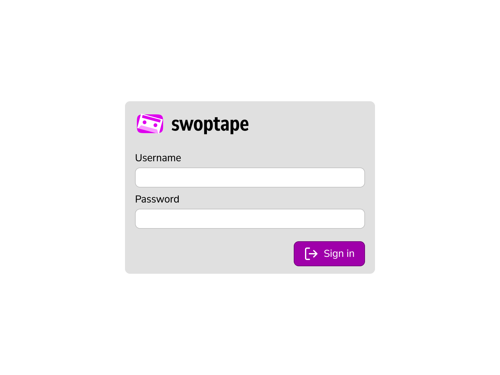

# Auth Screens

Shared auth screens used across swop* applications.

---

### `login.png`

The standard sign-in screen. Centered card with the application logo and name,
username and password fields, and a sign-in button.

---

### `first user.png`

Shown on first launch when no user accounts exist yet. Prompts the visitor to
create the initial admin account with username, password, and password
confirmation. Steps through to further setup on submit.
