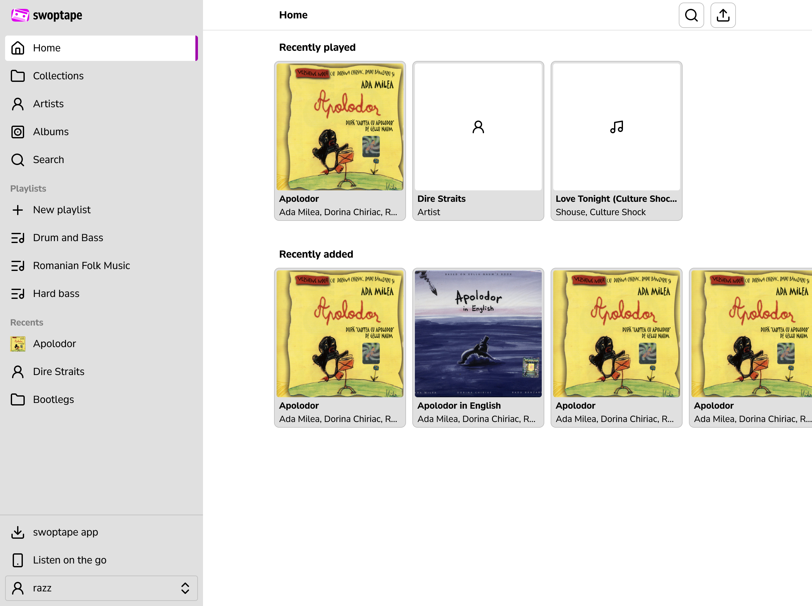
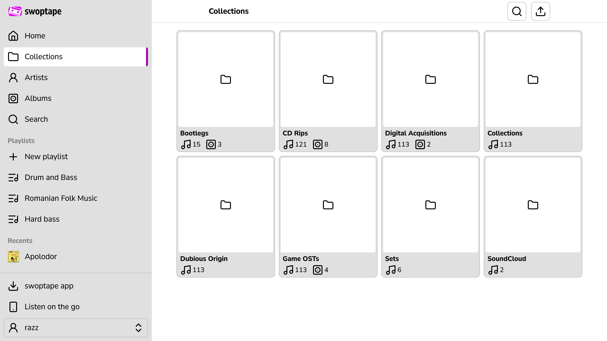
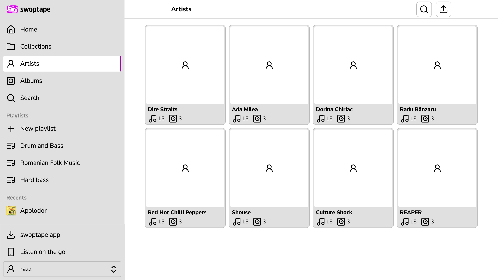
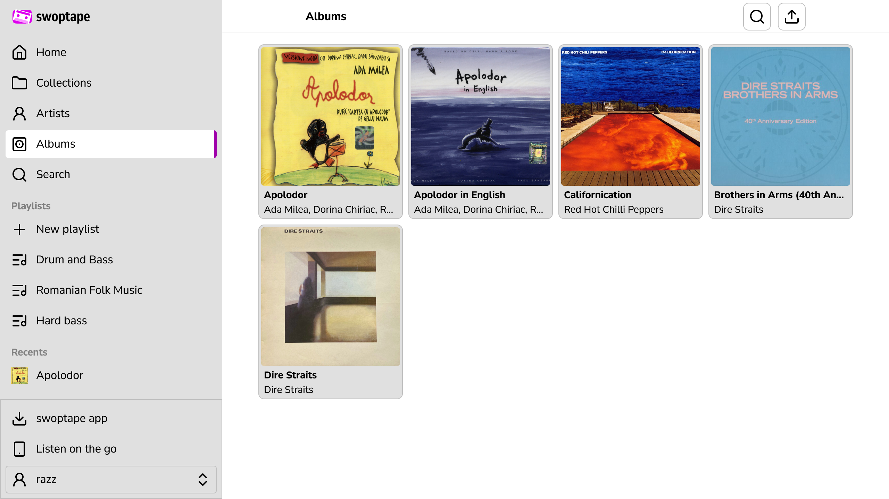
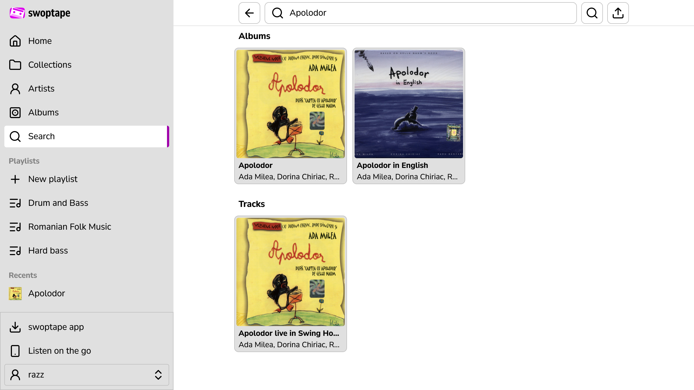

# swoptape Mockups

---

### `home.png`

The main home screen for a user with an established library. Shows **Recently
played** and **Recently added** grids. The left sidebar contains primary
navigation (Home, Collections, Artists, Albums, Search), playlists, recents,
and bottom links for the mobile app and account switching.

---

### `home - initial admin.png`

Empty state shown to an admin when the library has no tracks yet. Offers two
actions: **Manage library** (add folders from the server filesystem) and
**Upload tracks** (direct upload).

---

### `home - initial uploader.png`

Empty state shown to a user with the `upload` permission but without admin
access. Can upload tracks directly but cannot manage library folders.

---

### `home - initial user.png`

Empty state shown to a standard user when the library has no tracks. No actions
available — directs them to ask the instance administrator.

---

### `collections.png`

File-based navigation view. Displays top-level folders as cards (e.g. Bootlegs,
CD Rips, Digital Acquisitions, Game OSTs) with track and album counts. This is
the primary organisational view in swoptape — reflecting how music is actually
stored on disk rather than imposing a tag-based hierarchy.

---

### `artists.png`

Tag-based artist grid. Shows artist cards with placeholder artwork and track/album
counts. Only surfaced when tag quality is sufficient.

---

### `albums.png`

Tag-based album grid. Shows album art cards with album name and artist. Only
surfaced when tag quality is sufficient.

---

### `search.png`

Search results page. Groups results by type — Albums, Tracks — with artwork
cards for each match.
