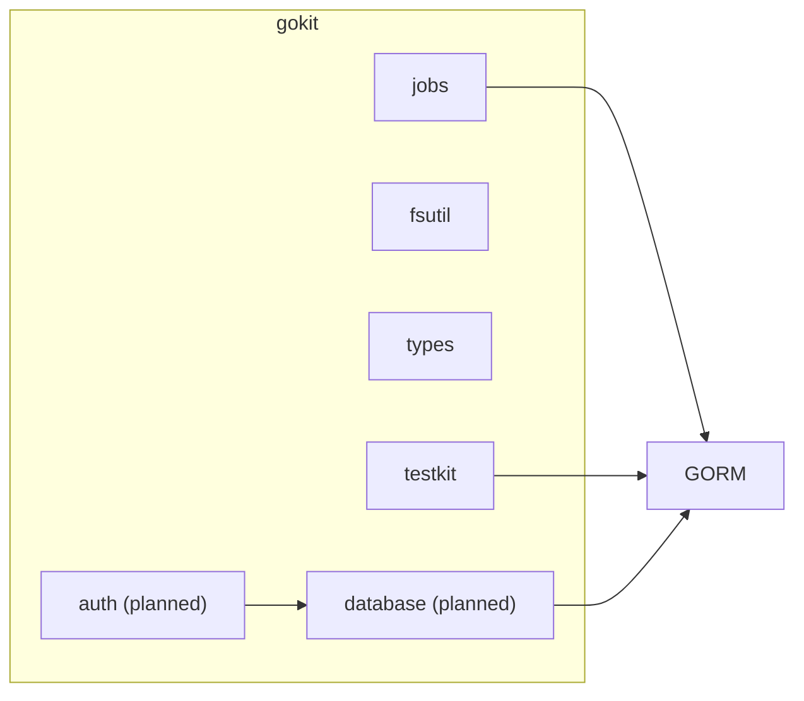

# gokit: Architecture

gokit is a flat collection of independent packages. Packages should avoid
depending on each other where possible to keep consumers from pulling in
unneeded dependencies.



## Package structure

```
jobs/       Background job scheduler, worker pools, cron scheduling, execution tracking
fsutil/     File system utilities
types/      Shared types (SimpleDate, etc.)
testkit/    Test harness — transaction-based DB isolation for integration tests
```

## Planned packages

```
database/   Shared GORM + PostgreSQL setup, auto-migrations
auth/       JWT signing/verification, session management
```

## Dependency policy

Each package should be independently importable. Avoid cross-package imports
within gokit — if two packages need to share something, promote it to `types`.
