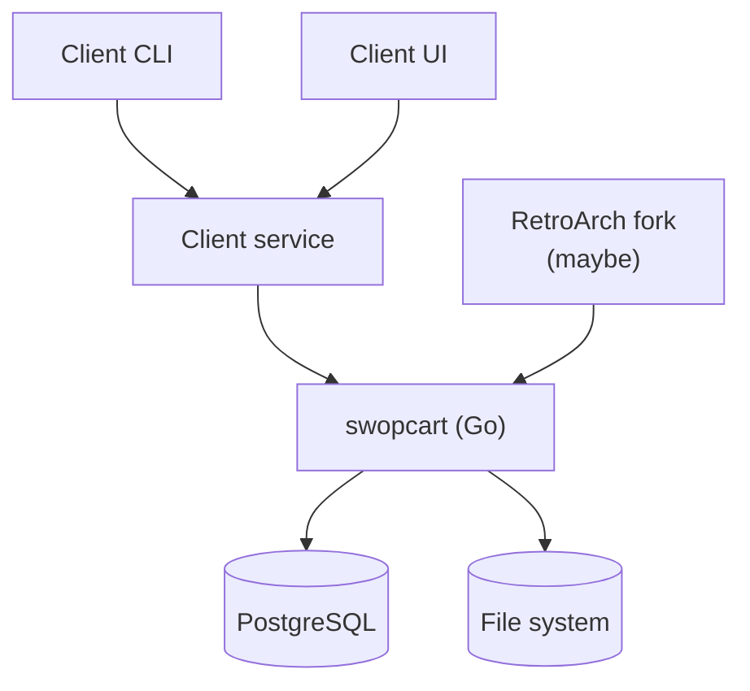
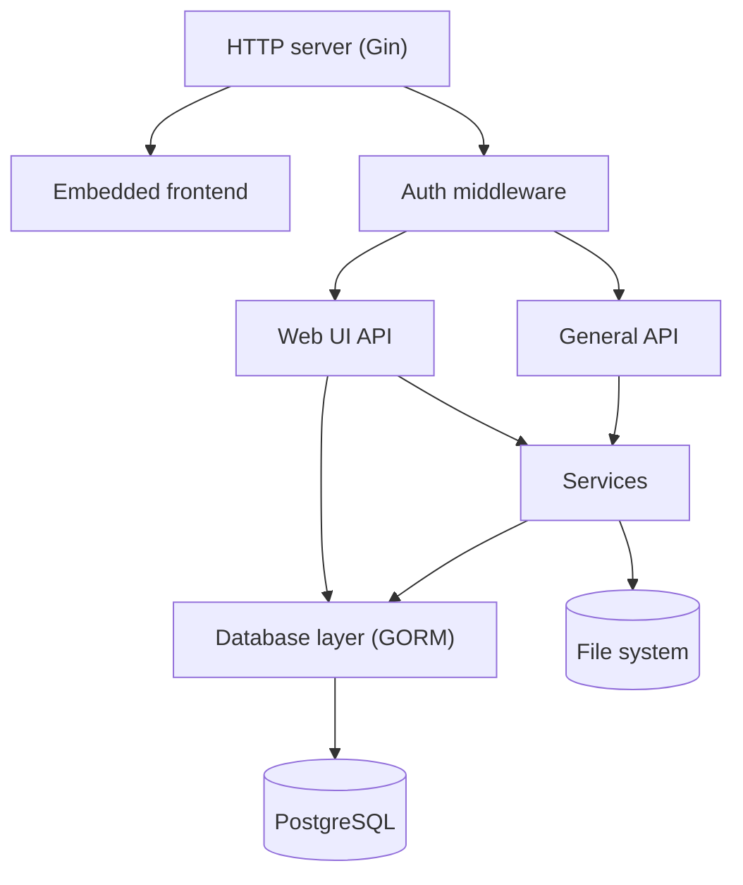

# swopcart: Architecture

## Overview



## swopcart (Server)

The server is a single Go binary that embeds the web frontend via `go:embed`.
It is designed to run behind a reverse proxy on low-power ARM64 hardware (typical
entry-level NAS, 1 GB RAM).

### Structure



### Services

| Service | Responsibility |
|---|---|
| `identity` | User management |
| `session` | JWT access and refresh tokens |
| `jobs` | Background job scheduler and worker pools (via gokit) |
| `cleanup` | Soft-delete cleanup job |
| `library` | Game library scanning, metadata, and downloads |
| `savedata` | Save file sync — two modes: **flag** (sync latest save, for project-style saves) and **checkpoint** (store a new save per play session, for progression-style saves) |
| `storage` | Swopcart-generated file storage |

### Package structure

```
cmd/swopcart/          Entry point — bootstraps config → database → services → HTTP server
internal/config/        TOML config loading; data directory via SWOPCART_DATA env var
internal/database/      GORM + PostgreSQL; auto-migrations; soft-delete on most models
internal/services/      Business logic, constructed with dependency injection
  identity/             User management
  session/              JWT access + refresh tokens
  jobs/                 Background job scheduler and worker pools (from gokit)
  cleanup/              Soft-delete cleanup job
  library/              Game library scanning, metadata, and downloads
  savedata/             Save file sync
  storage/              Swopcart-generated file storage
internal/www/           Gin HTTP server and routing
internal/www/api/       General API handlers and auth middleware
internal/www/webui/     Web UI API handlers
frontend/               React SPA (embedded into binary at build time)
```

### Key patterns

- **Single binary**: frontend assets embedded via `go:embed`, loaded on demand
- **Stateless auth**: short-lived JWT access tokens + long-lived refresh tokens
- **Streaming-first**: files served via streaming to avoid loading ROMs into memory
- **Background jobs**: cron scheduler + per-queue worker pools (via gokit)
- **Graceful shutdown**: waits for in-flight jobs before exiting

### Database models

`Platform` → `Library` → `Game` → `GameVersion`

Libraries support multiple scan paths. Games and libraries use soft-delete;
GameVersions are hard-deleted on reimport.

---

## Client

> The client is planned and not yet implemented. This section describes the
> intended architecture.

### Client service

A background daemon that runs on the client device. Responsible for:

- Communicating with swopcart
- Managing game downloads
- Syncing save files to and from the server

### Client CLI

A command-line utility that interfaces with the client service. Intended as the
low-level tool that higher-level UIs are built on top of.

### Client UI

A separate application built on the client service, targeting two form factors:

- **Desktop** — traditional windowed UI for PC
- **10-foot** — controller-friendly UI for Steam Deck and TV play

---

## RetroArch fork *(planned, maybe)*

An alternative client based on a RetroArch fork. Integrates directly with
swopcart to browse and launch games from within RetroArch, without needing the
client service or UI.
