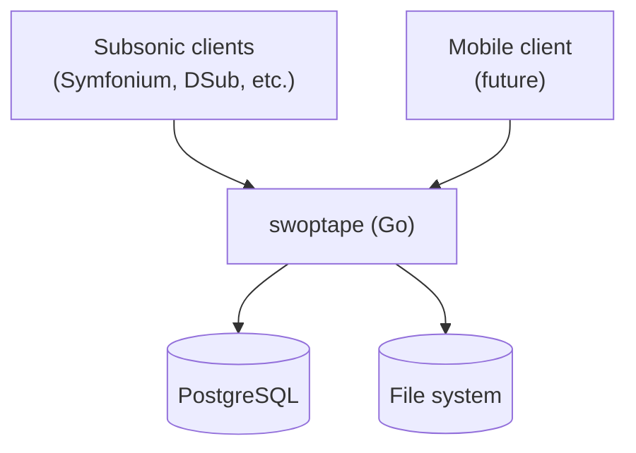
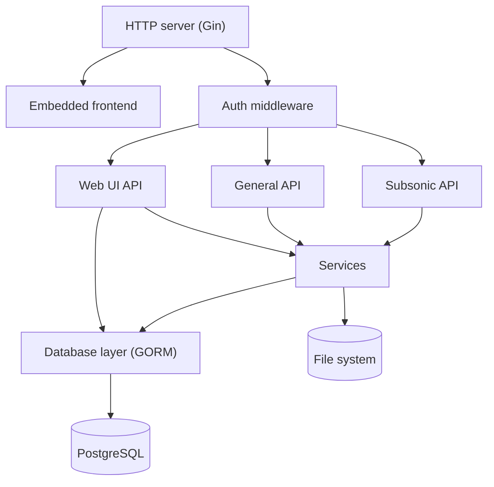

# swoptape: Architecture

## Overview



## swoptape (Server)

Same architecture as swopcart — a single Go binary with an embedded web
frontend, designed to run on low-power ARM64 hardware.

Unlike swopcart, packages live at the top level (no `internal/` wrapper) to
simplify import paths.

### Structure



### Services

| Service | Responsibility |
|---|---|
| `identity` | User management with granular permissions (`admin`, `upload`, `tag`) and TOTP |
| `session` | JWT access and refresh tokens; session tracking (IP, user agent, last used, revoked) |
| `jobs` | Background job scheduler and worker pools (via gokit) |
| `cleanup` | Soft-delete cleanup job |
| `library` | Music library scanning, metadata, streaming, and download |
| `storage` | swoptape-generated file storage |

### Package structure

```
cmd/swoptape/       Server daemon — started when the container comes up
cmd/st/             CLI utility — migrations, server inspection, admin tasks
config/             TOML config loading
database/           GORM + PostgreSQL; auto-migrations; soft-delete on most models
services/           Business logic, constructed with dependency injection
  identity/         User management
  session/          JWT access + refresh tokens
  jobs/             Background job scheduler and worker pools (from gokit)
  cleanup/          Soft-delete cleanup job
  library/          Music library scanning, metadata, streaming, and download
  storage/          swoptape-generated file storage
www/                Gin HTTP server and routing
www/api/            General API handlers and auth middleware
www/webui/          Web UI API handlers
www/subsonic/       Subsonic API implementation
frontend/           React SPA (embedded into binary at build time)
```

### Key patterns

- **Single binary**: frontend assets embedded via `go:embed`, loaded on demand
- **Stateless auth**: short-lived JWT access tokens + long-lived refresh tokens
- **Streaming-first**: audio served via streaming; download also supported
- **Subsonic compatibility**: Subsonic API implemented for early client support
- **File-first library**: collections reflect file structure; tag-based views
  only surfaced when tag quality is sufficient
- **Granular permissions**: `admin`, `upload`, `tag` — finer-grained than swopcart,
  planned to feed back into swopcart over time

### Planned gokit extractions

`database` and `auth` are currently implemented per-app. A single shared
implementation in gokit is planned to avoid divergence between swopcart and
swoptape.

### Database models

`Collection` → `Track`

Tag-based views (`Artist`, `Album`) derived from track metadata when quality
is sufficient.

---

## Mobile Client *(future)*

A mobile-first native app (iOS, Android) talking directly to swoptape. No
background service needed — without save sync there is nothing to run
persistently on the client device. Subsonic client compatibility covers this
use case in the interim.
